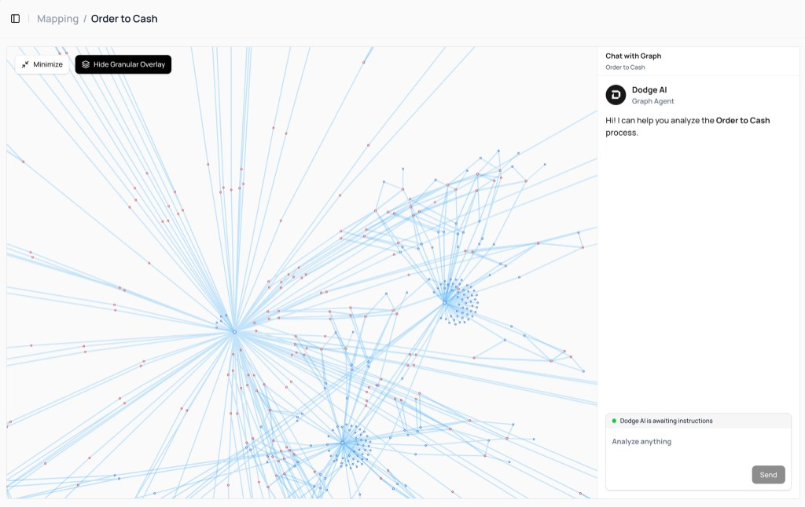
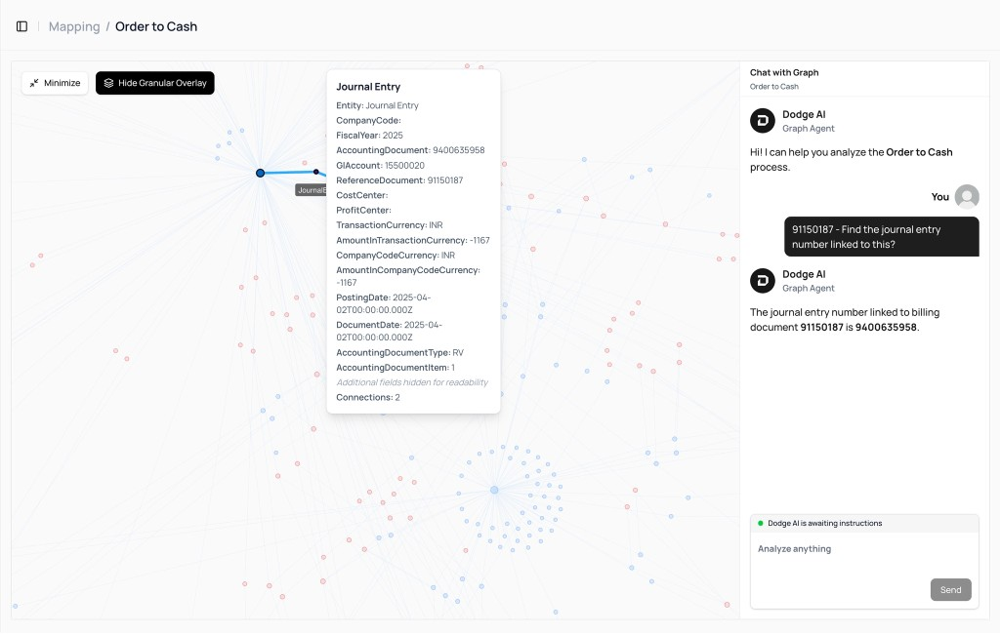
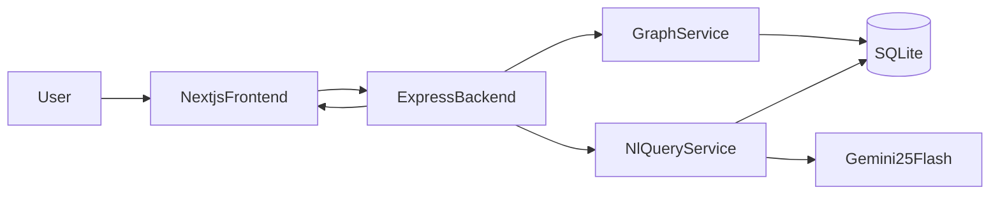

# O2C Context Graph + Conversational Query System

This project unifies fragmented Order-to-Cash (O2C) data into a graph and provides a natural-language query interface that returns dataset-grounded answers.

## Quick Links

- Architecture image export: `docs/diagrams/architecture-overview.svg`
- UI screenshots:
  - `docs/screenshots/graph-chat-overview.png`
  - `docs/screenshots/node-query-detail.png`
- Submission checklist: `SUBMISSION_CHECKLIST.md`

## Stack

- Frontend: `Next.js`, `ReactFlow`, `Tailwind`
- Backend: `Express` + `TypeScript`
- Database: `SQLite` (`better-sqlite3`)
- Query execution: `Kysely`
- LLM: `Gemini 2.5 Flash` (with deterministic fallback templates when API key is missing/unavailable)

## Problem Framing

Enterprise data is distributed across many entities:
- sales orders
- deliveries
- billing documents
- journal entries
- payments
- customers/products/plants/addresses

The system builds:
- a normalized relational model (truth layer),
- a graph projection for traversal and visual exploration,
- an NL query path that translates prompts to SQL with strict safety checks.

## UI Screenshots

### Graph + Chat Overview



### Node Detail + Query Response



## Architecture

### Exported Diagram (for submission/docs)


### Mermaid Source



## Data Modeling Decisions

### Core flow entities
- `sales_order_headers`
- `sales_order_items`
- `outbound_delivery_headers`
- `outbound_delivery_items`
- `billing_document_headers`
- `billing_document_items`
- `journal_entry_items_ar`
- `payments_ar`

### Supporting entities
- `business_partners`
- `business_partner_addresses`
- `products`
- `product_descriptions`
- `plants`
- additional assignment/reference tables from dataset

### Important normalization choices
- Document item IDs are normalized to 6-digit format (`10` -> `000010`).
- IDs are stored as text to preserve SAP-style formatting and avoid accidental numeric truncation.
- Raw source JSON is retained in each table for traceability/debugging.

## Graph Modeling

Graph node types:
- SalesOrder, SalesOrderItem, Delivery, DeliveryItem, BillingDocument, BillingItem, JournalEntry, Payment, Customer, Product, Plant, Address

Graph edge examples:
- `SalesOrder -> SalesOrderItem` (`HAS_ITEM`)
- `SalesOrderItem -> DeliveryItem` (`FULFILLED_BY`)
- `DeliveryItem -> BillingItem` (`BILLED_AS`)
- `BillingDocument -> JournalEntry` (`POSTED_TO`)
- `JournalEntry -> Payment` (`CLEARED_BY_PAYMENT`)
- `Customer -> SalesOrder` (`PLACED`)

## NL Query Pipeline

Pipeline:
1. Prompt received from chat UI
2. Domain guardrails check if prompt is in O2C scope
3. LLM generates structured SQL plan (or fallback deterministic template)
4. SQL safety validation enforces read-only + allowlist scope + limit
5. SQL executes on SQLite via Kysely
6. Response returns:
   - natural language answer,
   - executed SQL,
   - row count and preview data (grounding)

## Guardrails

Implemented at two layers:

1. **Prompt-domain guardrail**
   - Rejects unrelated prompts (e.g. poetry/general knowledge)
   - Standard rejection message:
     - `"This system is designed to answer questions related to the provided dataset only."`

2. **SQL safety guardrail**
   - Allows only `SELECT`/`WITH`
   - Blocks mutation/admin operations (`INSERT`, `UPDATE`, `DELETE`, `DROP`, etc.)
   - Blocks SQL comments
   - Restricts table access to known dataset tables
   - Forces bounded `LIMIT`

## API Endpoints

- `GET /health`
- `POST /ingest`
- `GET /graph/seed`
- `GET /graph/node/:nodeId`
- `GET /graph/neighbors/:nodeId`
- `POST /query`
- `GET /api/milestone-status`

## Local Setup

### 1) Install dependencies

```bash
cd backend && npm install
cd ../frontend && npm install
```

### 2) Environment

Create `.env` in project root from `.env.example`.

Key vars:
- `NEXT_PUBLIC_API_BASE_URL=http://localhost:4000`
- `PORT=4000`
- `SQLITE_PATH=./data/o2c.sqlite`
- `DATASET_DIR=./sap-o2c-data`
- `GEMINI_API_KEY=<optional but recommended>`
- `GEMINI_MODEL=gemini-2.5-flash`

### 3) Ingest data

```bash
cd backend
npm run ingest
```

### 4) Run backend

```bash
cd backend
npm run dev
```

### 5) Run frontend

```bash
cd frontend
npm run dev
```

Open `http://localhost:3000`.

## Validation (Milestone 6)

Run assignment-focused checks:

```bash
cd backend
npm run validate:queries
```

This validates:
- highest billed products query
- billing flow trace query
- broken/incomplete flow query
- off-topic guardrail rejection

## How Evaluation Criteria Are Addressed

- Code quality and architecture:
  - modular backend services (`ingestion`, `graph`, `query`)
  - typed contracts and explicit APIs
- Graph modeling:
  - clear node/edge taxonomy based on O2C lifecycle
- Database/storage choice:
  - SQLite + normalized schema for deterministic local analytics
  - graph projection derived from relational source of truth
- LLM integration/prompting:
  - schema-aware prompt context + structured output contract
- Guardrails:
  - prompt filtering + SQL safety validation

## Submission Checklist

Refer to `SUBMISSION_CHECKLIST.md` for final packaging steps (demo link, repo link, transcripts, and form submission).
